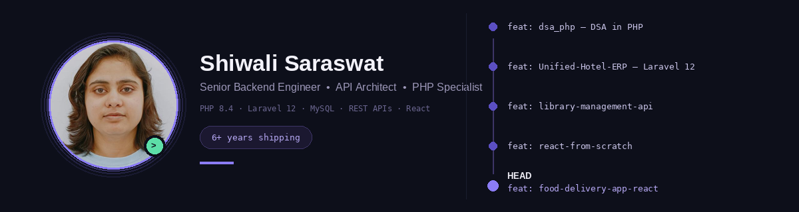

# Hi, I'm Shiwali Saraswat 👋

**Senior Backend Engineer · API Architect · PHP Specialist**

6+ years of experience building production-grade backend systems and scalable architectures — currently expanding into React on the frontend.

---

### 🛠 Tech Stack

**Languages & Frameworks**

**Database & Performance**

<!--  -->

**Architecture & Security**

**Payments & Integrations**

**Tools**

---

### 🚀 Featured Projects

#### [Unified Hotel ERP](https://github.com/shiwali-saraswat-dev/Unified-Hotel-ERP)
*A high-concurrency hospitality management suite built to demonstrate modern Laravel 12 patterns.*

- **Modernization:** architectural transition from Laravel 8 → Laravel 12, using PHP 8.x features
- **Security & IAM:** Role-Based Access Control (RBAC) integrated with Laravel Breeze for secure, multi-tenant administration
- **Data Integrity:** complex soft/permanent delete workflows and strict validation across modules
- **Full-Suite Modules:** Guest PMS (room booking), POS (food ordering), and BMS (banquet management)
- **UX/Performance:** custom frontend pagination, dynamic asset loading, real-time notifications via SweetAlert2/Toastr

`Laravel 12` `Blade` `MySQL` `Tailwind CSS`

#### [Library Management API](https://github.com/shiwali-saraswat-dev/library-management-api)
*A RESTful Laravel API for a library's catalog, members, borrowing workflow, reservations, and fines.*

- Concurrency-safe transactions and idempotent writes
- HATEOAS-style responses and OpenAPI-documented endpoints
- Auth via Sanctum, RBAC via spatie/laravel-permission

`PHP 8.3` `Laravel 12` `MySQL` `Pint`

#### [DSA in PHP](https://github.com/shiwali-saraswat-dev/dsa_php)
*A curated collection of data structures, algorithms, and problem-solving patterns in PHP, organized by topic — arrays, loops, conditions, strings, and pattern problems — for backend interview preparation.*

`PHP`

#### [React From Scratch](https://github.com/shiwali-saraswat-dev/react-from-scratch)
*A self-paced, step-by-step React learning log — from plain HTML and vanilla JS through JSX, functional components, and component composition.*

`React` `Vite` `Parcel` `JavaScript`

#### 🆕 Food Delivery App (React)
*Latest addition — applying React fundamentals to a real-world ordering flow.*

`React` `JavaScript`

---

### 📊 GitHub Stats

---

*Currently specialized in Backend Architecture · API Development · Laravel Ecosystem — growing into React*

